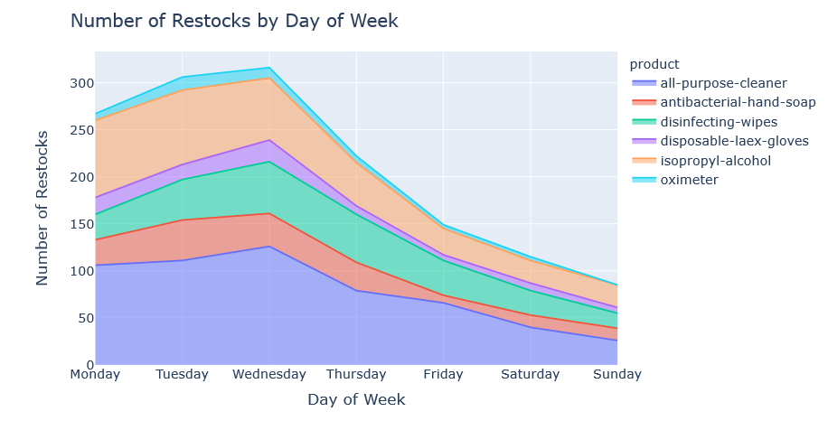
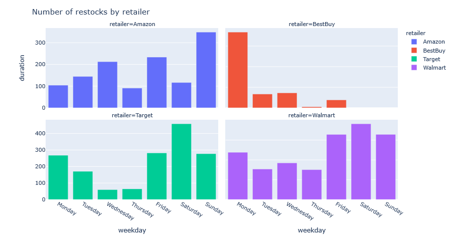

# Scrape-Inventory-Data-from-Zoolert
This script scrapes and saves the data from Zoolert.com. The product scraped includes disinfectant wipes, hand soaps, convenient noodles, etc. 

# About zoolert
Zoolert alerts consumers of restock of hot products. During Cov19, the household items related to cleaning and disinfectanting are frequently sold out. Zoolert allows users to set up alerts to track restocks. 

# Method

The notebook detailed how to extract home-related products from zoolert and their historical restocking data. The data is limited to 600 entries per product. To compose a complete picture, one needs to run the code multiple times and combine the data row-wise. The code will automatically extract the data and save it as a separate file using the date. 

# Results

Using the data I scraped from alst week, I did some simply visualization on when did the retailers restock products such as disinfecting wipes and hand soaps, and how long does the stocks last before it runs out again. See the notebook for more info. 

