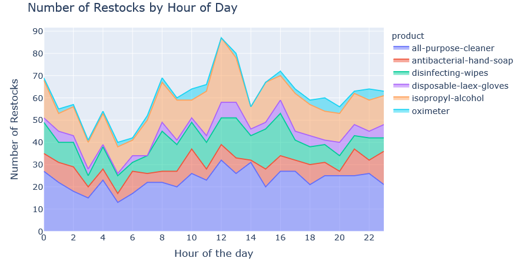
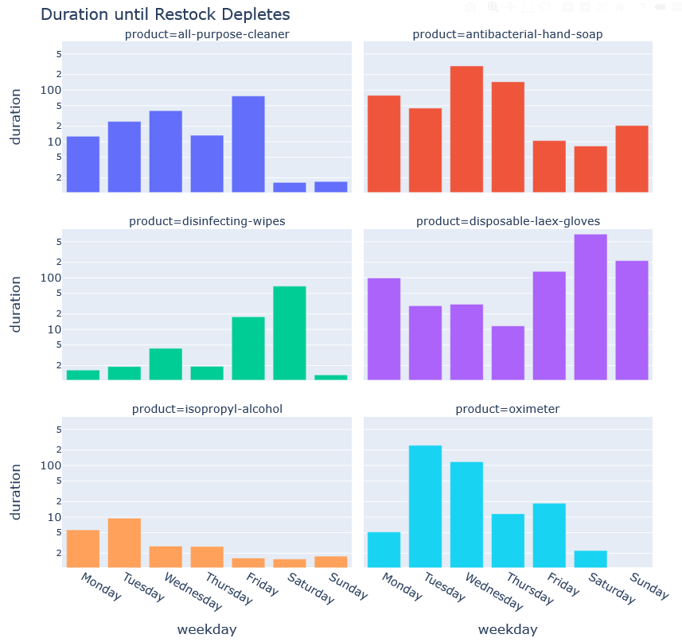

This is a small project about using python scripts to scrape and save the data from Zoolert.com. It is inspired by a 4-target-stores trip this week. I drove around in Brooklyn trying to find some cleaning supplies and disinfecting wipes. But I got nothing after vising 4 target stores and 1 costco. 

Later I found zoolert. So I decided to write a script and monitor the restocking activities online. 

# About zoolert
Zoolert alerts consumers of restock of products both online and offline. During Cov19, the household items related to cleaning and disinfectanting are frequently sold out on Amazon. Zoolert allows users to set up alerts to track these restocks. 

# Method

The notebook detailed how to extract home-related products from zoolert and their historical restocking data. The data is limited to 600 entries per product. To get a complete picture, one needs to run the code multiple times and combine the data row-wise. The code will automatically extract the data and save it as a separate file using the date. 

# Results

Using the data I scraped from alst week, I did some simply visualization on when did the retailers restock products such as disinfecting wipes and hand soaps, and how long does the stocks last before it runs out again. See the notebook or html file for more info. 

## The restocks by day of week and hour of day 

## How long does it take for the restock to get depleted again? Duration is in minutes and shown in log

